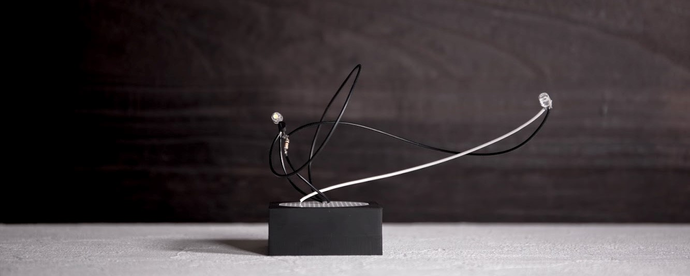

# はじめに

## 電子華道とは？

電子華道は、システムアーティスト日辻が2018年1月から[Instagram](https://instagram.com/kassen_project/)で公開を始めた「活線プロジェクト」の作品様式です。ユニバーサル基板を剣山に見立てて、専用の器に載せて一つの作品としており、日本に現在も受け継がれているいけばなの文化を踏襲しています。

このプロジェクトは個々のアートピースを完成品とするのではなく、その制作プロセス自体を作品主体としているので、これらを一つのツールキットとして様々な作品や新たな表現手法が派生(Githubの言葉を借りるならばフォーク)していくことを狙いとしています。

## 実際に作る

電子華道は、できるだけ既製品を使って制作できるように設計されています。電子回路が分からなくても楽しめますし、分かるとより楽しむことができます。

このリポジトリにアップロードされた器のモデルを3Dプリントすれば自分で全て用意することができますが、必要なものを買ってすぐに始められるキットも用意しているので、はんだごてさえあれば特別な機材は必要ありません。

## 必要なもの

必要な道具や材料の一覧と、おおよその金額です。★印がついたものは、スターターキットに含まれる予定です。

| 品目         | 入手方法              | 価格の目安      |
| ---------- | ----------------- | ---------- |
| 器          | キット販売 or 3Dプリント | ★1500円     |
| 基板         | キット販売 or 秋月電子   | ★150円      |
| 電子部品       | 後述                | ★様々        |
| 単線・撚線      | 電子部品屋・Amazon      | ★500円程度    |
| はんだごて・こて台  | ホームセンター・Amazon    | 2000～5000円 |
| ニッパー       | ホームセンター・Amazon    | 1000～3000円 |
| (ワイヤーストリッパー) | ホームセンター・Amazon           | 1000～3000円 |
| 養生プレート     | 専用                | 1000円      |

以下に詳しく紹介します。

### 器・基板

器は専用のものを設計しています。[ここに3Dモデル](../resources/vase)を用意していますので、3Dプリントすることも可能です。剣山の役目をする基板もはじめは[専用の基板](../resources/pcb)を使うのがやりやすいでしょう。慣れてきてたくさん作りたくなった場合は、安く手に入る代替品があります。

TODO:基本キットの販売ページへのリンク

### 電子部品

作品の顔とも言える要素です。はじめはLEDが良いでしょう、LEDだけでも花のようにたくさんの種類があります。好きな形、好きな色、メーカーで選んでみるのも楽しいかもしれません。部品選びについては、後のセクションで詳しく記述します。

### 単線・撚線

電子華道では、線を使い自由な形状を作っていきます。固く芯がある単線と、柔らかくしなやかな撚線（より線）という２種類の線を組み合わせて構成します。太さは概ね決まっていますが、色はある程度自由に選ぶことができます。これも後のセクションで記述します。

### はんだごて、こて台

はんだごては、基本的に電子工作と同じ物を使います。先が細いもので、できれば温度調節が可能な白光FX600などが理想です。安いものもありますが、はんだが溶けにくく初心者ほど扱いが難しくなります。

### 養生のためのプレート

はんだづけの最中、溶けたはんだが落ちて机に付着することがあります。汚れても良い板状の物を敷き、その上で作業するようにしましょう。

耐熱マットという専用のものもありますが、A4程度の広さがあり、平たければ不要な段ボールや木の切れ端でも問題ありません。

### ニッパー（ワイヤーストリッパー）

配線を切ったり曲げたりするのに、ニッパーを使います。制作する機会が増えてきたら、線材の被覆を剥く際にワイヤーストリッパーがあるとより便利です。
