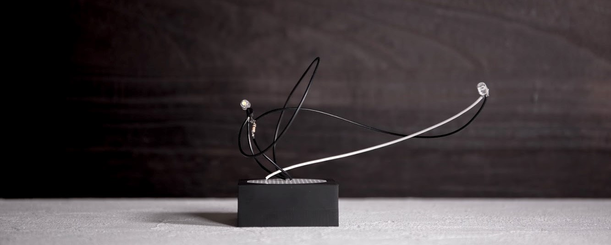

# イントロダクション

## 電子華道とは？

電子華道は、システムアーティスト日辻が2018年1月から[Instagram](https://instagram.com/kassen_project/)で公開を始めた「活線プロジェクト」の作品様式です。ユニバーサル基板を剣山に見立てて、専用の器に載せて一つの作品としており、日本に現在も受け継がれているいけばなの文化を踏襲しています。

このプロジェクトは個々のアートピースを完成品とするのではなく、その制作プロセス自体を作品主体としているので、これらを一つのツールキットとして様々な作品や新たな表現手法が派生(Githubの言葉を借りるならばフォーク)していくことを狙いとしています。

## 実際に作る

電子華道は、できるだけ既製品を使って制作できるように設計されています。電子回路が分からなくても楽しめますし、分かるとより楽しむことができます。

このリポジトリにアップロードされた器のモデルを3Dプリントすれば自分で全て用意することができますが、必要なものを買ってすぐに始められるキットも用意しているので、はんだごてさえあれば特別な機材は必要ありません。
