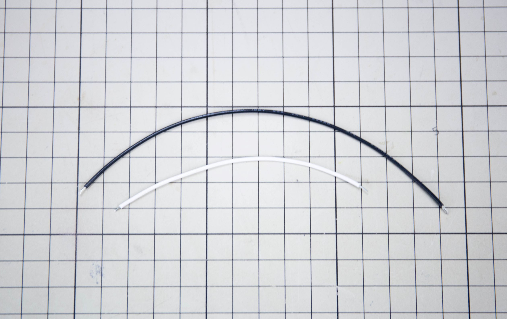

# はんだ付け

## 電子工作の基本

電子華道は、電子工作の制作プロセスを応用した創作行為ですので、まず電子工作の基礎的な知識が必要となります。**すでに電子工作を経験したことがあり、簡単な電子回路なら作れる**という方は次の**「[04_制作基礎](04_Making_basic.md)」**へ進んでください。

### はんだづけ

はんだ付けは、基板と部品や、部品と配線同士を付けるための工程です。はんだと呼ばれる金属をはんだごてで溶かし、接合部分になじませて（溶着と呼びます）くっつけます。**電子華道では、このはんだ付けで形を固定していきます。**

### 基板のはんだ付け

基板に部品を取り付けたら、2～3秒部品と基板側の金属部分（ランド）を温めたあと、はんだを当てて溶かしていきます。こてが当たっている時間が長いとランドが基板から剥がれたり、はんだの熱しすぎで形が悪くなってしまうので、溶けて馴染んだと思ったらすぐ離すようにします。

写真右側が正しく付いた状態です。富士山型になっているのが理想で、左側は温度不良でダマになった状態です。ダマになっていると基板と線が電気的に導通しない場合があるので、数秒はんだごてをあてて溶かし馴染ませましょう。**あまりはんだごてを長時間当てすぎると、基板のランドが剥がれてしまうので注意が必要です。**

### 部品とケーブルのはんだ付け

部品とケーブルをはんだ付けするのはやや特殊で、通常あまり推奨されません。（通常部品は基板にのみ実装し、ケーブルは圧着されたコネクタを使って接続します）しかし**電子華道の場合はむしろ作品の形を決める要とも言える工程です。**

まず部品とケーブルのはんだ付けする部分にそれぞれはんだを付けます。あまりつけすぎてはんだが山盛りになってしまうと見た目にも悪いので、少しで十分です。両方の部品にはんだを付けたら、両者を近づけ、それぞれに盛ったはんだを溶かして合体させます。

### ケーブルの線を剥く

ケーブルは電気を通す金属の導線を、電気を通さないビニールの被覆で覆ってあります。この被覆だけをニッパーやワイヤーストリッパーを使って剥き、はんだ付けするための**導線部分を露出**させます。電子華道で使うケーブルは針金のように**少し固めの単線（白）**と、**柔らかくしなやかな撚線（黒）***の2種類を組み合わせて使います。ワイヤーストリッパーを持っている方はAWG24-22の溝を使って引き抜き、ニッパーだけの方は被覆の周りに切れ込みを入れるように挟んで、グイっと被覆だけを引き抜きます。

撚線の方は細い導線が束になっているので、ニッパーを使っている方は線を切らないよう注意してください。1～2本なら切れても問題ありません。

## より詳しい情報

ここでは電子華道をやる上で最低限必要な工程を解説しました。より詳しい情報ははんだごてメーカーや電子部品メーカーが制作しているページに優しい図解が載っていますので、そちらも合わせて参考にしてください。

- **[はんだ付けテクニックを学ぼう！ | HAKKO](http://handa-craft.hakko.com/)**
- **[電子工作のコツ/はんだ付け | 村田製作所](https://www.murata.com/ja-jp/campaign/ads/japan/elekids/ele/craft/knack/soldering)**
- **[プロのはんだ付けのコツとテクニック - プリント基板実装｜基板改造｜基板改修](https://www.kogadenshi.co.jp/半田付けテクニック/)**