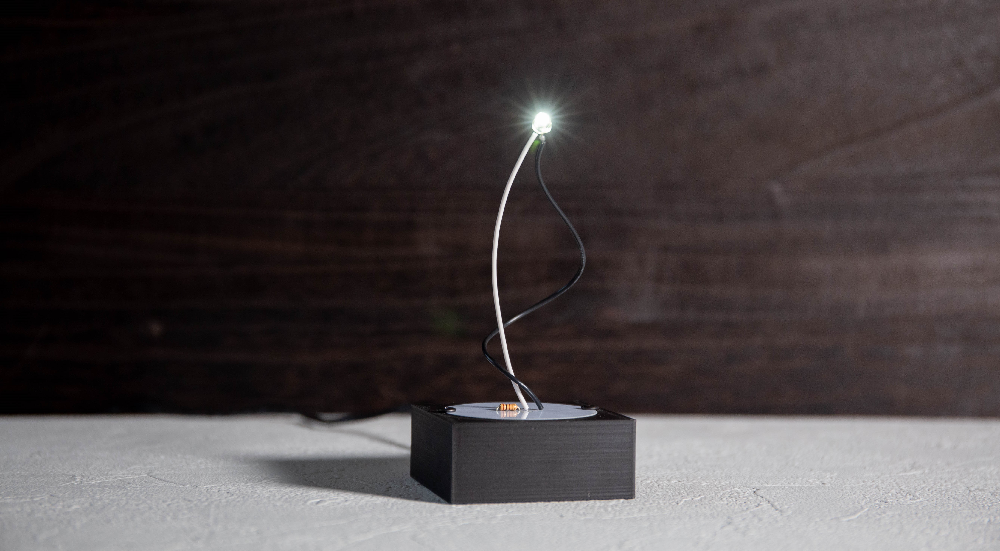

# 制作の基本形

## LED点灯回路をいける

この解説では、電子華道の基本要素であるLEDをいけていきます。電源側から抵抗を介してLEDの＋（アノード）側に白い線で接続し、ー（カソード）側から黒い線を伸ばしてグラウンドに接続しています。

## 用意するもの

基本キットに含まれるものを使って解説していきます。

**左上から：**

- ユニバーサル基板：**電源の接続が省略可能な[専用基板](../resources/pcb/universal_plate_v1)を使います。
- **LED：**5Vで動作するLEDを使います。
- **カーボン抵抗100Ω：**LEDにとりつける抵抗器です。
- **器：**作品を載せる器です。電源の供給元にもなります。
- **撚線・単線：**回路を作るための線材です。
- **ACアダプター：**家庭用コンセントから電源を供給するためのものです。

## 抵抗を付ける

まずは基板に**抵抗器**を付けます。茶色いひょうたん型で、2本の足が伸びています。向きの違いはありません。

基板の裏面に「VCC」と「GND」という文字が書かれています。これは電池で言う**プラスとマイナス**を意味していて、ここから電気をもらいます。白い面に薄く線が盛り上がっているところがありますが、線が繋がっている穴は全て電気的に繋がっていることを意味します。

抵抗から出ている線の片方をVCC側に、もう片方をそこから2個飛ばした中央付近に差し込みます。
差し込んだ抵抗は、裏側でL字に折り、抜けないようにしておきます。

## 線を作る

電子華道では、２種類の線を使います。針金のように形が固定される **「単線」**と、**柔らかくしなやかな「撚線（よりせん）」**です。キットでは単線が白、より線は黒になっています。白い単線を10㎝ほど、黒い撚線を15～6㎝くらいで切ってみましょう。単線は針金のように形が固定されるので、つまみながらしごいて形を整えます。ここではゆるくカーブする程度が良いでしょう。

形を整えたら、線のビニル部分（被覆）を剥いて金属部分を露出させます。両側とも5mm程度ずつ線材が出るようにします。

## LEDと単線を付ける

LEDと線をつなぎます。**LEDにはプラスマイナスがあり、足が少し長い方がプラス**です。両側の足を写真のように横に倒し、長い方を短く切ってしまいます。両方切ってしまうとプラスマイナスが分かりにくくなるので注意してください。

LEDの足が長い方と単線の短く線を出した方を、はんだで繋ぎます。LEDと単線それぞれにまず少しはんだを盛りつけます。はんだと線の温度が近くなると、スッとはんだが線に馴染みます。この手順を「濡らす」と言いますが、これをすると２つがくっつきやすくなります。はんだがダマになっていたりするとうまくつかないので、はんだが染み込むまで（2～3秒）じっと待ちましょう。

LEDの頭が正面に来ると見栄えが良いので、正面を意識して付ける向きを決めます。向きが決まったら、はんだごてで濡らしたはんだを溶かしながら二つを溶着します。

## 単線を基板に取り付ける

LEDを付けた単線の逆サイドを、基板に取り付けます。**抵抗の中央よりの足に隣り合う穴**に差し込み、はんだ付けをします。
この時抵抗の足を使って、単線と抵抗がはんだで接続されるように取り付けます。この時、裏面の印刷で上側が正面に来るようにしておくと、後々レイアウトがしやすくなります。

はんだ付けをしたら、単線の向きを調整します。ある程度空中で固定できるので、高くのびやかなイメージで配置してみましょう。

## 撚線の位置を決める

単線を取り付けたら、今度は撚線を付けます。まず長く剥いた方を基板のGND側に取り付けます。GNDにはんだ付けしたら今度は逆側をLEDに付けるのですが、この時単線の流れ、単線と撚線の関係性を意識しながら、撚線を少しねじったり方向を変えたりすると面白い表情が生まれます。単線が芯の力で支えてくれるので、撚線は張力に身を任せるようにして形を決めることで美しくゆるやかなカーブを描かせることができます。

止めたい形が決まったら、先端をLEDにはんだ付けして固定します。**テンションがかかってLEDがやや引っ張られる**ので、単線を動かして形を整えます。

## 器におさめる

作品ができたら、器に収めます。器にはACアダプタから電源を供給するための配線が取り付けられているので、これを器に接続します。

基板の両端にある半円状の銅箔を、器から伸びている丸端子に接続します。VCCが赤、GNDが青に対応しています。

まず片方の丸端子の位置を器に空いている穴位置と揃えて、同梱の六角レンチでボルトを仮止めします。そこに基板を横から差し込んだあと、もう片方にボルトを差し込みながら挟み込むようにして固定します。

固定できたら、DCジャックを差し込んで通電します。スイッチは無いので、ACアダプタを差した瞬間にLEDが点灯すれば完成です。

5Vで動作する電子部品であれば自由に配線することができますので、好きな形、好きな部品を使って色々な電子いけばなを楽しんでみてください。