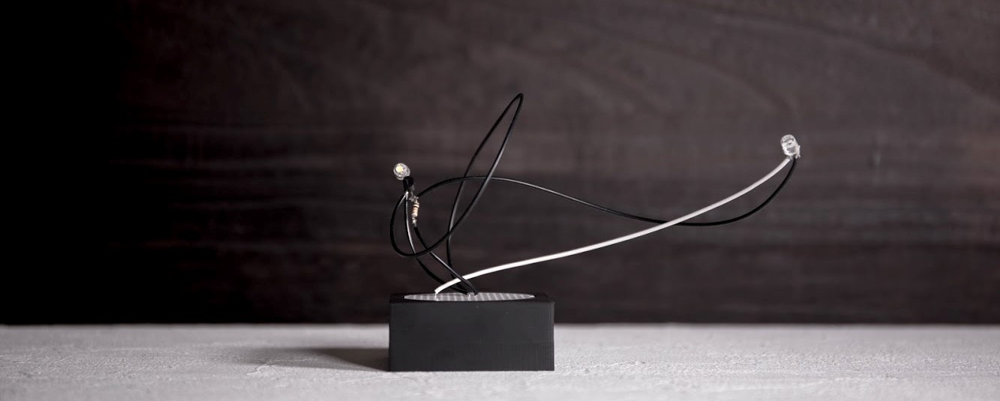

# 電子華道ツールキット

## はじめに

このリポジトリは、電子部品をいけばなに見立てた[活線プロジェクト](https://www.instagram.com/kassen_project/)の制作過程で設計された、電子いけばなを制作するためのリソースをまとめた物です。

## データ構成

### ドキュメント(/documents)

電子華道の手引きをドキュメントにまとめます。工作的な手順から、造形を綺麗にしあげるためのコツまでをできるだけ体系的にまとめます。

### リソース(/resouces)

電子いけばなを制作する中で、市販されていない物の設計をまとめたデータアセット集。専用のユニバーサル基板や、3Dプリント、切削加工で生産可能な器のモデルデータをまとめます。