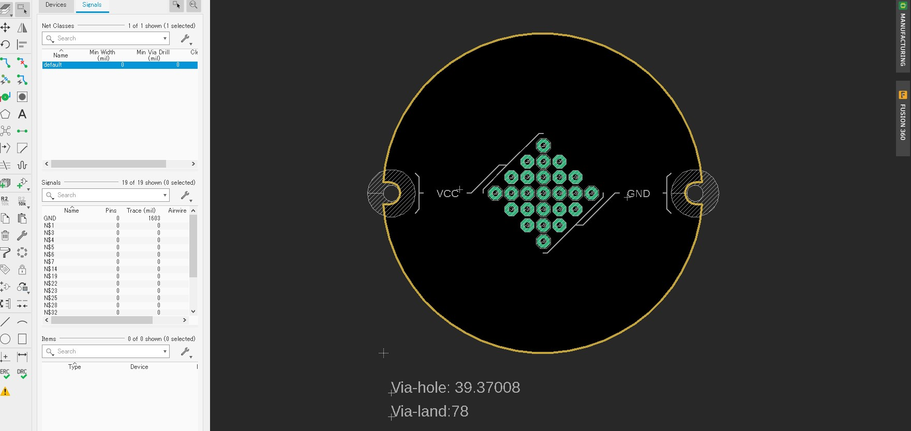

# 基板仕様

作品をいけるための基板に関する資料です。[テナリのショップ](https://shop.tenari.jp/)でも販売していますが、この仕様書に沿って既存の基板を自分で制作、もしくはオリジナルの基板をデザインすることが可能です。データはEagleで制作しています。

- [ユニバーサル基板universal_plate_v1](universal_plate_v1)

## 基本仕様

ユニバーサル基板としての機能を持つ複数のビアと、電源用のVCC,GNDラインを用意しています。秋月電子通商で販売している[丸型ユニバーサル基板](http://akizukidenshi.com/catalog/g/gP-08755/)をベースに制作しており、この基板からビアの数を最低限に抑え、電源の配線を付加したものです。