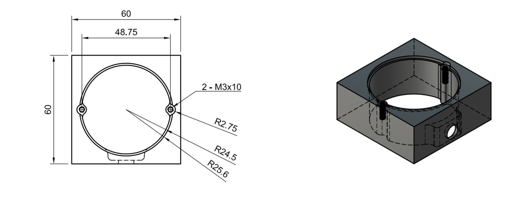

# 器仕様

作品を乗せるための器に関する仕様です。テナリのショップでも販売していますが、この仕様書に沿って既存の器を自分で制作、もしくはオリジナルの器をデザインすることが可能です。モデルデータはそれぞれのフォルダにSTL・STEP・PDF図面の3つを用意します。

- [01_直方体](vase01_square)
- 02_円柱(制作中)
- 03_六角柱(制作中)

器は「作品を固定して保持する機能」と「美観を保ちながら電源を供給する機能」を満たすように０設計されています。3Dモデルデータを制作しているので、3Dプリントや樹脂切削によって制作が可能ですが、電源端子が接触するため金属の器を使用する事は難しいです。

## 準拠する基板

[/resources/pcb](../pcb)にあるユニバーサル基板が適合します。この基板は、秋月電子通商の[片面丸形ユニバーサル基板50.8mm(P-08755)](http://akizukidenshi.com/catalog/g/gP-08755/)をもとに設計したもので、こちらの方は穴数が多く比較的安価に手に入りますが、1作品ごとに接続できる電源コネクタを用意する必要があります。

## 電源

器に加えて、以下の電源用部品を使用します。電源パーツの組み立てには、はんだごてと圧着工具が必要です。

- パネル取付用2.1mmDCジャック(マル信無線電機MJ-14) 1個
- 丸端子（R1.25-3 JIS C2805に準拠）2個
- AWG16(1.25sq)撚線 4cm x 2本

器裏の穴にDCジャックを差し込み、付属のナットで固定します。丸端子は作品を固定する際ボルトと一緒に挟みこみます。

## 3Dプリントの推奨設定

テナリの販売ページにあるキットの器は、Zortrax M200+を使って出力されたものです。
他の3Dプリントでも同様に出力が可能ですが、精度によってはネジ穴がうまく出力されないといったことが考えられますので、他のプリンタを使用する際は下記出力設定を参考にしてください。

| 項目        | 値               |
| --------- | --------------- |
| ノズル径      | 0.4mm           |
| 積層厚み      | 0.14mm          |
| タイプ       | NORMAL          |
| インフィルパターン | PATTT.2（ハニカム構造） |
| インフィル密度   | 20％             |
| サポート材ギャップ | 0.36mm          |
| プリント時間※   | 3h48min                |

※プリント時間はZortrax M200+を使用した場合の参考時間
